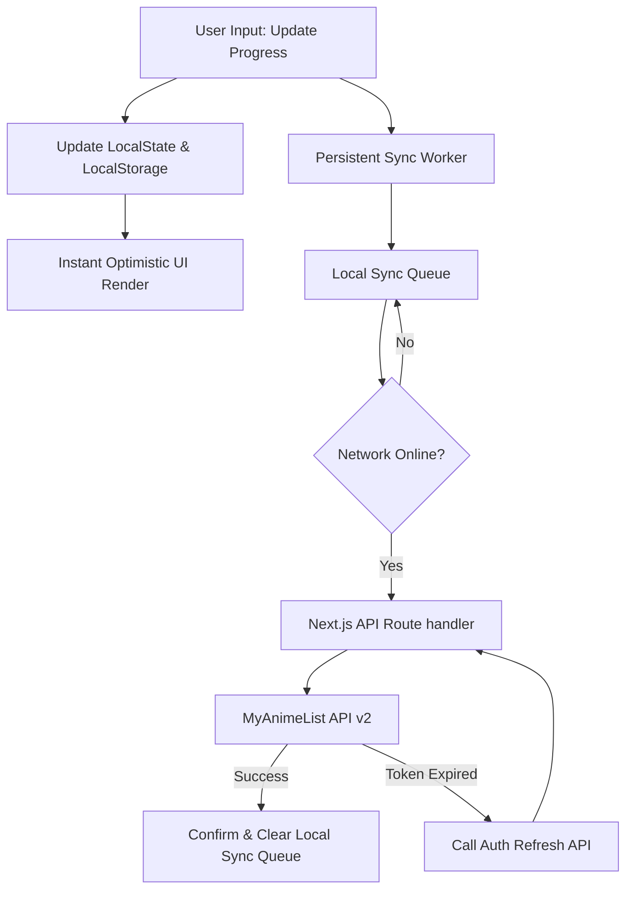

# AniJikan 🎌

A professional, feature-rich, and performance-optimized seasonal anime tracker built with Next.js that integrates seamlessly with MyAnimeList, AniList, and Jikan. Track your watchlist, explore upcoming seasons, view detailed anime insights, and sync your state in real time—all through a modern, responsive user experience.

[](https://nextjs.org/)
[](https://react.dev/)
[](https://tailwindcss.com/)
[](https://www.typescriptlang.org/)
[](https://tanstack.com/query)
[](https://vitest.dev/)
[](https://playwright.dev/)
[](https://vercel.com/)
[](LICENSE)

---

## 🌟 Overview

AniJikan is a full-stack anime tracking application that combines data from three major anime APIs (MyAnimeList, AniList, and Jikan) to deliver a unified and blazing-fast experience. 

Designed with an offline-first philosophy, AniJikan utilizes browser local storage as a quick-read cache for instantaneous UI interactions (such as updating scores or episode counts), while coordinating behind the scenes via a queue-based background synchronization worker to persist data to MyAnimeList.

---

## 🤖 AI Collaboration & Project Evolution

AniJikan is a prime example of human-AI developer synergy:

- **The Core Foundation**: The entire initial application architecture, UI layout, routing schema, and third-party API integration layers were designed and built manually by its original developer, **[Zikri](https://github.com/Zikri809)**.
- **The Modern Iteration**: The subsequent platform-wide modernization—including migrating the codebase from Next.js Pages Router to the App Router structure, a complete conversion to strict TypeScript, setting up the testing harness (Vitest and Playwright), hardening OAuth authentication cookies, and configuring CI automation pipelines—was co-authored and implemented in collaboration with **Codex** and **Antigravity** (an advanced agentic AI coding assistant developed by Google DeepMind).

---

## ✨ Features

### 🔐 Enterprise-Grade Authentication
* **MyAnimeList OAuth2 with PKCE**: Fully secure OAuth login flow utilizing Proof Key for Code Exchange (PKCE) to prevent interception attacks.
* **Intelligent Background Refresh**: Dedicated API route automatically refreshes user access tokens 2 days before expiry to preserve long-term session continuity without user interruption.
* **Detailed User Dashboard**: Real-time rendering of MyAnimeList profiles, including user statistics, avatars, and top-rated entries.

### 📺 Watchlist & State Management
* **Dual-State Sync**: Instant visual response on the client via `localStorage` paired with eventual-consistency background sync to MyAnimeList via custom API proxies.
* **Conflict-Free State Transitions**: Mutually exclusive watchlist states (e.g., adding an anime to *Completed* automatically prunes it from *Watching* or *Plan to Watch* to avoid database conflicts).
* **Granular Tracking**: Update watched episode counts, assign scores (0-10), and change watch states via interactive forms.
* **Offline Resiliency**: Unsaved sync actions are queued locally if the user loses connectivity and are retried sequentially once online.

### 🗓️ Deep Seasonal Browsing
* **Automatic Season Detection**: Dynamic, server-side algorithm detects the current season based on the calendar month and system time.
* **Extended 11-Season Carousel**: Navigate seamlessly across a temporal span of 11 seasons (4 past seasons, the current season, the upcoming season, and 5 future/scheduled seasons).
* **Multi-Criteria Sorting & Filtering**: Sort seasonal lists by average score, popularity, members, or release date.

### 🔍 Advanced Search & Discovery
* **AniList GraphQL Integration**: A trending carousel showcases high-resolution banner images and current popular shows fetched via the AniList GraphQL engine.
* **Sanitized Query Search**: Complete title search powered by Jikan, sanitizing input vectors to prevent URL breakages and escape characters.
* **Rich Detail Pages**: Comprehensive views featuring synopses, genre tags, scores, studio credits, video trailers, and direct anime sequels/prequels (relations).

### 🎨 Premium UI/UX Design
* **Glassmorphism & Dark Mode**: Sleek dark aesthetic designed with custom CSS variables and utility classes, utilizing `@shadcn/ui` and Radix accessibility primitives.
* **PWA & Mobile Optimization**: Mobile-first touch interactions, custom gestures (swipe to switch tabs), and Apple-specific splash screen media configurations.
* **Perceived Performance**: Component skeletons minimize loading jumps during async requests.

---

## 🏗️ Architecture & Data Sync Model

### 1. Dual-Sync Synchronization Engine
When a user updates an anime tracking status, the system runs a split-data flow:



* **Client Optimistic UI**: Changes are immediately stored in the browser's `localStorage` maps (`Watching`, `Completed`, `PlanToWatch`, `OnHold`, `Dropped`).
* **Non-Blocking Syncing**: The `persistent_worker` component continuously polls the sync queue to batch updates to our backend API proxy, eliminating page loading blocks.

### 2. High-Performance Caching & ISR
* **12-Hour Page Cache**: Public seasonal and anime detail data use a `revalidate` period of 43,200 seconds (12 hours) to respect Jikan and MAL API rate limits.
* **Crawler Protection**: Expensive route families reject known bulk crawlers, `robots.txt` exposes a deliberately small crawl surface, and production traffic is expected to be protected by Vercel Firewall rules.

---

## 🏗️ Tech Stack

### Core Framework & State
* **[Next.js 16.2.6 (App Router)](https://nextjs.org/)** - File-based routing, server components, and optimized build bundler.
* **[React 19](https://react.dev/)** - UI library featuring hook enhancements and server rendering.
* **[TanStack Query v5](https://tanstack.com/query)** - Handles query caching, state invalidation, and asynchronous data hydration.

### CSS & Styling
* **[Tailwind CSS v4](https://tailwindcss.com/)** - Utility-first styling with modern CSS-first theme configuration.
* **[shadcn/ui](https://ui.shadcn.com/)** - Accessible UI components built on Radix UI primitives.
* **[lucide-react](https://lucide.dev/)** - Iconography.

### Automated Testing & Linting
* **[Vitest](https://vitest.dev/)** - Light speed unit testing running against DOM rendering mockups.
* **[Playwright](https://playwright.dev/)** - Headless and headed E2E browser automation to test complex authentication and tracking journeys.
* **[ESLint](https://eslint.org/)** & **[TypeScript](https://www.typescriptlang.org/)** - Static analysis and type safety checkpoints.

---

## 📁 Project Structure

```
AnimeTracker-Next-js/
├── .github/                  # CI/CD Workflows (CI check, ISR Warmups)
├── data/                     # Static configurations and initial data states
├── public/                   # Static assets (PWA icons, splash screens, manifest)
├── src/
│   ├── app/                  # Next.js App Router (Pages, Layouts, API Handlers)
│   │   ├── Anime/            # /Anime/[id] Detail and /Anime/[id]/tracking routes
│   │   ├── api/              # API Route Handlers (Auth, seasonal proxy, sync cron)
│   │   │   ├── anime/        # Upstream data proxy endpoints
│   │   │   ├── cron/         # Daily schedule runs and ISR warmups
│   │   │   ├── seasonal/     # Static seasonal data routes
│   │   │   └── users/        # OAuth callback, refresh token, session routes
│   │   ├── ExceedRetryLimit/ # Error landing page
│   │   ├── morelastseason/   # Extended views for previous season
│   │   ├── morethiseseason/  # Extended views for current season
│   │   ├── moreupcoming/     # Extended views for next season
│   │   ├── mylist/           # User's tracking watchlist Dashboard
│   │   ├── search/           # /search/[query] URL search results
│   │   └── seasons/          # /seasons/[season]/[year] seasonal browser
│   ├── components/           # shadcn/ui shared primitives (dialog, tab, progress)
│   ├── ComponentsSelf/       # Custom feature components (Navbar, Carousel, Worker)
│   ├── context/              # Context providers (Auth, Query Client)
│   ├── hooks/                # Custom React hooks (useLocalStorage, useAuth)
│   ├── lib/                  # Library utilities (shadcn utils, AniList Client)
│   ├── styles/               # Global CSS styles (Tailwind imports)
│   ├── types/                # Strict TypeScript declaration types
│   └── Utility/              # Pure functions (Calculations, Storage parsing, Gestures)
├── tests/                    # Playwright E2E browser tests
├── playwright.config.ts      # E2E test configuration
├── tsconfig.json             # TypeScript compiler settings
└── package.json              # Dependency manifests
```

---

## 🚀 Getting Started

### Prerequisites
* **Node.js** 20.x or higher
* **npm** or **yarn** package manager
* **MyAnimeList API Keys**: Required for user synchronization.

### 1. Clone & Install
```bash
git clone https://github.com/Zikri809/AnimeTracker-Next-js.git
cd AnimeTracker-Next-js
npm install
```

### 2. Environment Variables Configuration
Create a `.env` file in the root folder of the project:

| Variable | Example Value | Description |
| :--- | :--- | :--- |
| `Client_ID` | `ab12cd34ef56...` | MyAnimeList App Client ID |
| `Client_Secret` | `xyz123...` | MyAnimeList App Client Secret |
| `NEXT_PUBLIC_Local_host` | `http://localhost:3000/` | Local host domain with trailing slash |
| `Prod_host` | `https://your-app.vercel.app/` | Production Vercel domain with trailing slash |
| `dev_auth_redirect` | `http://localhost:3000/api/users/auth/callback` | Redirect callback URL in development |
| `prod_auth_redirect`| `https://your-app.vercel.app/api/users/auth/callback`| Redirect callback URL in production |

#### 🔑 Registering MyAnimeList API Client:
1. Log in to [MyAnimeList](https://myanimelist.net/) and head to **[API Panel](https://myanimelist.net/apiconfig)**.
2. Create a new App Client. Select **web** as the application type.
3. Configure the **App Redirect URL** exactly to match your redirection route (e.g. `http://localhost:3000/api/users/auth/callback` for local testing).
4. Save client details and copy the generated `Client ID` and `Client Secret` into your `.env` file.

### 3. Spin up Server
To start the local Next.js hot-reloaded dev server:
```bash
npm run dev
```
Navigate to `http://localhost:3000` to preview the project.

---

## 🧪 Testing & Validation

The codebase maintains a strict standard of testing before merge approval.

### Execution Scripts
Run these commands from the root directory:

* **`npm run test`** - Executes Vitest suite to test parsing, season offsets, and storage hooks.
* **`npm run test:watch`** - Opens Vitest UI/Watcher mode.
* **`npm run test:e2e`** - Triggers Playwright tests to perform UI interactions, search journeys, and authentication redirects.
* **`npm run typecheck`** - Checks compilation validity under standard TypeScript.
* **`npm run lint`** - Analyzes code formatting and pattern compliance.
* **`npm run verify`** - Triggers the sequential pipeline of lint, typecheck, unit tests, and Playwright tests locally.

---

## 🚢 CI/CD & Deployment

### Vercel Deployment (Recommended)
This repository is configured for immediate deployment to Vercel:
1. Connect your repository to your Vercel Dashboard.
2. Input all required production environment variables (`Client_ID`, `Client_Secret`, `Prod_host`, `prod_auth_redirect`).
3. Ensure the project root and install commands are left as default.

### GitHub Actions Workflows
* **Continuous Integration (`ci.yml`)**: Automatically triggers on all pull requests and pushes to `main`. It initializes a Node 20 environment, installs dependencies, verifies code linting/formatting, checks TypeScript types, compiles the build, and executes both unit tests and headless Playwright tests.
* **Production traffic controls**: Follow [`docs/vercel-crawler-protection.md`](docs/vercel-crawler-protection.md) before attaching a public custom domain.

---

## 🤝 Contributing
As AniJikan is feature-complete, it is now primarily in **maintenance mode**. Bug fixes, security reviews, and dependency upgrades are highly welcome.

1. Fork this repository.
2. Create a specific branch (`git checkout -b fix/issue-description`).
3. Commit with detailed descriptions (`git commit -m "Fix: issue description"`).
4. Push to origin (`git push origin fix/issue-description`).
5. Create a detailed Pull Request.

---

## 📄 License
This project is licensed under the **MIT License**. Check the [LICENSE](LICENSE) file for more information.

---

## 👨‍💻 Developer & Collaborators

* **Lead Creator**: Built manually by **[Zikri](https://github.com/Zikri809)** with a love for anime and full-stack development.
* **Collaborative AI Agents**: Extended, modernized, and migrated in partnership with **Codex** and **Antigravity**.
* **Data Sources**: Special thanks to **MyAnimeList** for the v2 user endpoints, **AniList** for their rich GraphQL carousel data, and **Jikan** for the public-facing REST API proxy.

---
*Created by anime enthusiasts, for anime enthusiasts.* 🎌
